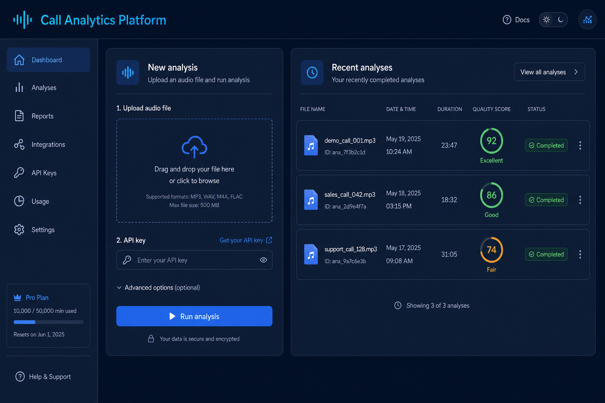
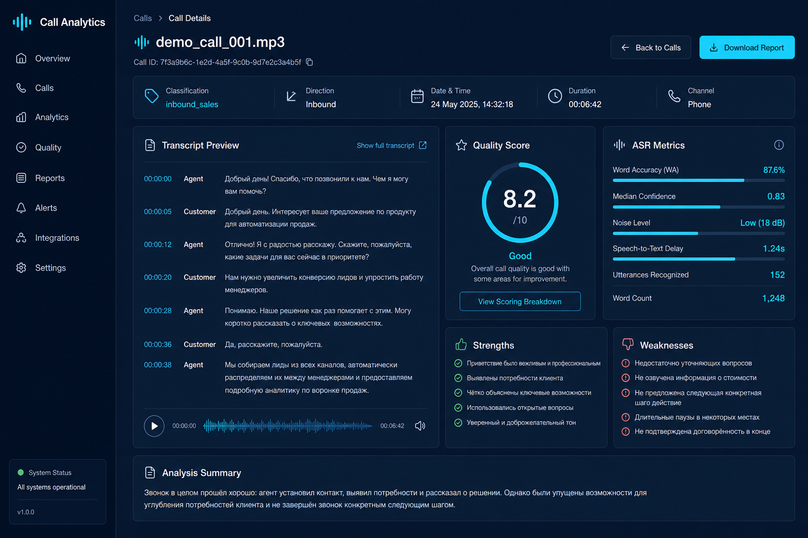
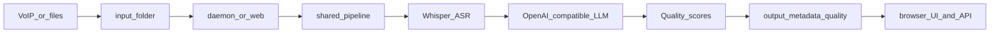

# Call Analytics Platform

**Self-hosted call analytics: Whisper ASR → LLM cleanup & classification → local QA artifacts.**

[](https://opensource.org/licenses/MIT)
[](https://www.python.org/downloads/)
[](https://github.com/FUYOH666/Scanovich.ai-audio-call)
[](https://github.com/FUYOH666/Scanovich.ai-audio-call/actions/workflows/ci.yml)
[](https://github.com/FUYOH666/Scanovich.ai-audio-call/releases)
[](docs/README.md)



Process phone recordings on infrastructure **you control**. No mandatory cloud SaaS. Optional Telegram and Google Sheets integrations.

**Deep reference (CLI, config, troubleshooting):** [`README_EN.md`](README_EN.md) · **Русский обзор:** [`PROJECT_OVERVIEW.md`](PROJECT_OVERVIEW.md)

---

## Who it's for

- **QA and operations teams** that review phone calls and need structured feedback, not just raw transcripts.
- **Privacy-first organizations** that want speech analytics on-prem or inside their own network boundary.
- **Engineers running a pilot** who need a working web UI, HTTP API, and CLI over the same pipeline.

## Why local-first

- Audio and transcripts stay on **your** disks by default.
- Fits teams that care about data residency (GDPR-style processes, FZ-152-aware deployments) without claiming legal certification out of the box.
- Open core under MIT — extend, fork, or self-host without vendor lock-in.

---

## Quick start

Evaluating fit first? See [`docs/EVALUATION_GUIDE.md`](docs/EVALUATION_GUIDE.md).

### 1. Install

```bash
git clone https://github.com/FUYOH666/Scanovich.ai-audio-call.git call-analytics
cd call-analytics
uv sync
cp config.example.yaml config.yaml
cp branches.example.yaml branches.yaml
```

### 2. Configure ASR + LLM

Minimal `config.yaml`:

```yaml
asr:
  model_preset: "auto"
  device: "cuda"   # or "cpu" for small tests

vllm:
  enabled: true
  base_url: "http://localhost:8000/v1"   # local or remote OpenAI-compatible server
```

Point `vllm.base_url` (and `quality_analysis.base_url` if enabled) at your LLM gateway. Keep real hostnames in local config or env — not in git.

### 3. Run the web UI

```bash
uv run python main.py web
```

Open `http://127.0.0.1:8080` — upload a file, inspect results, browse saved analyses.

### 4. Minimal mode (no Telegram / Google Sheets)

```yaml
analytics:
  telegram:
    enabled: false

google_sheets:
  enabled: false
```

Core flow still works: **ASR → LLM →** artifacts in `output/` and `metadata/`.

### 5. Optional: protected pilot

```bash
export WEB__REQUIRE_API_KEY=true
export WEB__API_KEY=replace-with-a-strong-key
uv run python main.py web --host 0.0.0.0 --port 8080
```

---

## What you get

| Output | Path | Purpose |
|--------|------|---------|
| Clean transcript | `output/<id>.txt` | Masked, LLM-cleaned text |
| Metadata | `metadata/<id>.json` | Classification, ASR metrics |
| Quality JSON | `quality_analysis/individual/<id>.json` | Optional QA scoring |

**HTTP API:** `GET /healthz` · `POST /analyze` · `GET /analyses` · `GET /analyses/{id}` · `/` (browser UI)

**Daemon mode:** `uv run python main.py run` watches `input/` for batch / VoIP workflows.



---

## Architecture



Implementation map: [`src/pipeline_service.py`](src/pipeline_service.py) · [`src/web/app.py`](src/web/app.py) · [`docs/ARCHITECTURE.md`](docs/ARCHITECTURE.md)

---

## Documentation

| I want to… | Start here |
|------------|------------|
| **Evaluate** before deploying | [`docs/EVALUATION_GUIDE.md`](docs/EVALUATION_GUIDE.md) → [`docs/examples/`](docs/examples/README.md) |
| **Deploy** for demo or production | [`DEPLOYMENT_GUIDE.md`](DEPLOYMENT_GUIDE.md) → [`docs/DEPLOYMENT_PROFILES.md`](docs/DEPLOYMENT_PROFILES.md) |
| **Understand** the codebase | [`docs/ARCHITECTURE.md`](docs/ARCHITECTURE.md) → [`CONTRIBUTING.md`](CONTRIBUTING.md) |
| **Get answers** quickly | [`docs/FAQ.md`](docs/FAQ.md) |

Full index: [`docs/README.md`](docs/README.md) · Roadmap: [`docs/ROADMAP.md`](docs/ROADMAP.md) · Changes: [`CHANGELOG.md`](CHANGELOG.md)

---

## Community & trust

- [`SECURITY.md`](SECURITY.md) — responsible disclosure and data-handling expectations
- [`CODE_OF_CONDUCT.md`](CODE_OF_CONDUCT.md) — collaboration norms
- [`CONTRIBUTING.md`](CONTRIBUTING.md) — how to propose changes
- [`LICENSE`](LICENSE) — MIT

## Commercial support

Need pilot setup, on-prem deployment, or custom QA criteria? See [`FUNDING.md`](FUNDING.md) and [scanovich.ai](https://scanovich.ai).
