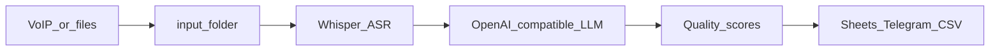

# ASR Call Quality Analyzer

**Language:** [🇷🇺 Русский](README.md) | [🇬🇧 English](README_EN.md)

[](https://opensource.org/licenses/MIT)
[](https://www.python.org/downloads/)
[](https://github.com/FUYOH666/Scanovich.ai-audio-call)
[](https://scanovich.ai)

**Production-ready system for automatic transcription and quality analysis of phone calls**

---

## Brief Description

ASR Call Quality Analyzer is a fully automated system for analyzing customer service quality over the phone. The system uses local AI models (Whisper for transcription and LLM for analysis), ensuring 100% data confidentiality and significant cost savings compared to commercial solutions.

**Version:** see `pyproject.toml` / `uv run python main.py --version`

**For:** Medical centers, call centers, retail, banks, education — any business with phone customer service.

---

## At a glance



- **Telephony audio:** typical **8 kHz mono** VoIP is normalized and resampled (default **16 kHz** mono before ASR) — see `asr.preprocessing` in [`config.example.yaml`](config.example.yaml).
- **Synthetic examples** (transcript + JSON shape): [`docs/examples/`](docs/examples/README.md).
- **10-criteria starter pack** for any industry: [`templates/generic_sales_support.md`](templates/generic_sales_support.md) + [`config.generic.example.yaml`](config.generic.example.yaml).
- **Remote LLM** (GPU server / VPN): [`docs/REMOTE_ASR_AND_LLM.md`](docs/REMOTE_ASR_AND_LLM.md).

---

## Problems It Solves

### Main Problems:

1. **Lack of objective quality assessment** — manual call evaluation is inefficient and subjective
2. **High cost of commercial solutions** — external APIs cost tens of thousands of dollars per year
3. **Risk of confidential data leakage** — using external services puts customer PII at risk
4. **Insufficient analytics detail** — lack of detailed metrics and recommendations for staff training

### Use Cases:

- **Medical centers:** quality control of appointment scheduling, compliance with consultation scripts
- **Call centers:** automatic operator performance evaluation, identification of common errors
- **Banks:** control of financial product sales, technical support quality analysis
- **Retail:** consultation evaluation, upsell metrics analysis

---

## Features

### 🎯 Core Functionality

- ✅ **Automatic transcription** — Whisper (modern models), RTF < 0.1 (10+ times faster than real-time)
- ✅ **Quality analysis by 30 criteria** — objective scoring from 0 to 100 points
- ✅ **PII masking** — automatic protection of customer personal data
- ✅ **Data normalization** — unification of branch addresses and administrator names
- ✅ **3-level analytics** — Telegram reports, Google Sheets Dashboard, CSV export

### 📊 Analytics and Reports

- ✅ **Daily Telegram reports** — automatic summaries at 09:00
- ✅ **Weekly reports** — administrator rankings and trends
- ✅ **Google Sheets Dashboard** — time series with upsell metrics
- ✅ **Detailed analytics** — top-3 errors, branch rankings, recommendations

### 🔒 Security and Performance

- ✅ **Your data, your machines** — recordings and transcripts stay on infrastructure you control; LLM can be local **or** your own OpenAI-compatible server ([remote setup](docs/REMOTE_ASR_AND_LLM.md))
- ✅ **Production-ready** — systemd services, graceful shutdown, error handling
- ✅ **$51K/year savings** — compared to commercial solutions
- ✅ **Multi-format support** — JSON/MP3/WAV/M4A (Asterisk, VoIP systems)

---

## Requirements

### Hardware Requirements:

- **GPU:** NVIDIA GPU with 24GB+ VRAM (RTX 4090/5090 or similar recommended)
- **RAM:** 16GB+
- **Disk:** 100GB+ free space
- **CUDA:** 12.0+ (for PyTorch)

### Software Requirements:

- **OS:** Linux (Ubuntu 22.04+)
- **Python:** 3.12 (only supported version)
- **VLLM:** Running on port 8000 with LLM model (30B+ parameters recommended for quality)
- **uv:** Package manager (installed automatically)

---

## Installation

### Quick Installation

```bash
# 1. Clone the repository
git clone git@github.com:FUYOH666/Scanovich.ai-audio-call.git call-analytics
cd call-analytics

# 2. Install uv (if not installed)
curl -LsSf https://astral.sh/uv/install.sh | sh
export PATH="$HOME/.cargo/bin:$HOME/.local/bin:$PATH"

# 3. Sync dependencies
uv sync

# 4. Copy example configurations
cp config.example.yaml config.yaml
cp branches.example.yaml branches.yaml

# 5. Configure config.yaml
# Edit config.yaml: specify Telegram chat_id, Google Sheets ID, etc.

# 6. Verify installation
uv run python main.py health
```

**Expected output:**
```
✓ Config valid
✓ GPU: NVIDIA GPU available
✓ VLLM available
✓ Telegram bot active
✓ Google Sheets available
```

### Installing systemd services (for 24/7 operation)

```bash
# 1. Install all services
sudo ./systemd/install_all_services.sh

# 2. Start services
sudo systemctl start vllm.service
sudo systemctl start asr-watcher.service

# 3. Check status
sudo systemctl status vllm.service asr-watcher.service
```

**More details:** See `DEPLOYMENT_GUIDE.md`

---

## Usage

### Quick Start

```bash
# Start daemon in 24/7 mode
uv run python main.py run

# Stop: Ctrl+C (graceful shutdown)
```

### Main CLI Commands

#### Transcription:
```bash
uv run python main.py run              # Daemon 24/7 (main mode)
uv run python main.py process-file input/call.mp3  # Process single file
uv run python main.py health           # System diagnostics
uv run python main.py metrics          # Processing statistics
```

#### Quality Analysis:
```bash
uv run python main.py analyze-quality  # Analyze single call (30 criteria)
uv run python main.py analyze-batch    # Batch analysis of all transcriptions
uv run python main.py report           # Administrator report (Markdown)
```

#### Analytics:
```bash
uv run python main.py aggregate        # Generate data marts (day/week)
uv run python main.py telegram-report  # Send to Telegram (daily/weekly)
uv run python main.py export-csv       # Export errors to CSV
```

#### Google Sheets:
```bash
uv run python main.py sync-sheets      # Batch synchronization
uv run python main.py update-dashboard # Update Dashboard for the day
uv run python main.py test-sheets      # Check access
```

Full command list: see `main.py --help`

---

## Configuration

### Main Config (config.yaml)

Main parameters are already optimally configured for modern GPUs with 24GB+ VRAM.

**What you can configure:**
- `analytics.telegram.chat_id` — your Telegram chat ID
- `analytics.telegram.enabled` — enable/disable Telegram reports
- `google_sheets.spreadsheet_id` — your Google Sheets ID
- `google_sheets.enabled` — enable/disable Google Sheets sync

**Creating config.yaml:**
```bash
cp config.example.yaml config.yaml
# Edit config.yaml for your business
```

### Address and Admin Normalization (branches.yaml)

```yaml
branches:
  - address: "Street Example, Building 123"
    variants: ["street example 123", "street example", "avenue example"]
    
admins:
  - canonical_name: "Admin Name"
    variants: ["variant1", "variant2", "variant3"]
```

**Creating branches.yaml:**
```bash
cp branches.example.yaml branches.yaml
# Fill in real branch addresses and administrator names
```

---

## Documentation

### Main Documentation:

- **`README.md`** — English quick-start (repo default)
- **`DEPLOYMENT_GUIDE.md`** — complete deployment guide
- **`docs/ARCHITECTURE.md`** — pipeline and `src/` modules
- **`PROJECT_OVERVIEW.md`** — short product summary and doc index
- **`CHANGELOG.md`** — change history
- **`SECURITY.md`** — security policy
- **`CONTRIBUTING.md`** — contributor guide
- **`docs/REMOTE_ASR_AND_LLM.md`** — LLM on another host / CPU ASR notes
- **`docs/examples/README.md`** — synthetic sample outputs

### Evaluation Scripts:

- **`script_evaluation_template_a.md`** — Template A evaluation script (extended)
- **`script_evaluation_template_b.md`** — Template B evaluation script (standard)
- **`templates/generic_sales_support.md`** — 10-criteria starter pack (see `templates/README.md`)

### Configuration:

- **`config.example.yaml`** — configuration example
- **`config.generic.example.yaml`** — example `analytics` + `scripts` for the generic template
- **`branches.example.yaml`** — address and admin normalization example

---

## Contributing

Thank you for your interest in the project! We welcome contributions from the community.

### How to Contribute:

1. **Fork & Clone** — fork the repository and clone
2. **Create feature branch** — `git checkout -b feature/your-feature`
3. **Make changes** — follow code style (ruff, pyright)
4. **Add tests** — for new functionality
5. **Check security** — run `./check_before_commit.sh`
6. **Create Pull Request** — describe changes in detail

**More details:** See `CONTRIBUTING.md`

---

## License

This project is licensed under the MIT License. See the `LICENSE` file for details.

**Copyright (c) 2025 Aleksandr Mordvinov (ScanovichAI)**

---

## Commercial Support and Services

### Professional Services

This project is an open-source solution demonstrating the capabilities of call quality analysis automation. The following services are available for commercial implementation and customization:

#### 🔧 Consultation and Configuration
- Analysis of your business processes and requirements
- Selection of optimal configuration for your infrastructure
- Customization of evaluation scripts for your quality standards

#### 🚀 Deployment and Integration
- Installation and configuration on your infrastructure
- Integration with your PBX, CRM, analytics systems
- Configuration of integrations with Telegram, Google Sheets, other systems

#### 📚 Training and Support
- Training your team to work with the system
- Technical support and consultations
- Updates and feature development

#### 🏢 Enterprise Solutions
- Multi-tenant architecture for large organizations
- Custom analytics dashboards
- Extended integration with corporate systems
- SLA and availability guarantees

### Why Choose This System:

- ✅ **100% local** — all data stays with you, no external APIs
- ✅ **Savings** — significant savings compared to commercial solutions
- ✅ **Scalability** — from 10K to 100K+ calls/month on a single GPU
- ✅ **Flexibility** — easily adapts to any industry and business processes
- ✅ **Production-ready** — proven architecture running 24/7

**💼 For commercial inquiries:** visit [scanovich.ai](https://scanovich.ai) for detailed information about commercial services, pricing, and collaboration terms.

---

## Performance

### Performance:

- **Throughput:** up to 100K+ calls/month on a single GPU
- **Processing speed:** RTF < 0.1 (10+ times faster than real-time)
- **Accuracy:** objective evaluation by 30 configurable criteria
- **Stability:** production-ready, runs 24/7

### Economics:

- **Cost:** $0 with local deployment
- **Savings:** significant savings compared to commercial API solutions
- **ROI:** fast payback when using your own infrastructure

---

## Project Structure

```
call-analytics/
├── src/                    # Source code (21 modules, ~6100 lines)
│   ├── asr.py              # Whisper Large V3 transcription
│   ├── vllm_postprocessor.py   # LLM masking + normalization
│   ├── quality_analyzer.py     # 30 criteria analysis
│   ├── db_manager.py           # SQLite database
│   ├── analytics_aggregator.py # Data marts day/week + upsell
│   ├── dashboard_generator.py  # Dashboard row generator
│   ├── telegram_reporter.py   # Telegram reports
│   ├── google_sheets_integrator.py  # Google Sheets
│   ├── branches_manager.py     # Branch/admin normalization
│   ├── daemon_watcher.py      # Main daemon (watchdog)
│   └── ... (12 other modules)
├── tests/                  # Tests
├── input/                  # Incoming audio (.mp3, .wav, .m4a)
├── output/                 # Transcriptions (.txt)
├── metadata/               # Classification (JSON)
├── quality_analysis/       # Quality scores (JSON)
├── analytics/              # SQLite DB + data marts
├── archive/                # Processed audio (30 days)
├── quarantine/             # Corrupted/problematic files
├── logs/                   # System logs
├── credentials/            # Google Sheets credentials
├── systemd/                # Systemd services
├── pyproject.toml          # Project configuration (uv)
├── uv.lock                # Locked dependencies
├── uv.toml                # uv configuration (PyTorch index)
├── config.example.yaml    # Configuration example
├── branches.example.yaml   # Normalization example
├── main.py                 # CLI (18 commands)
└── README.md               # This documentation
```

---

## Troubleshooting

### VLLM unavailable
```bash
uv run python main.py health
# Check: curl http://localhost:8000/v1/models
```

### Telegram not sending
```bash
# Check chat_id in config.yaml
uv run python main.py telegram-report --type daily
```

### Google Sheets access error
```bash
uv run python main.py test-sheets
# Check credentials/google_credentials.json
```

### Dashboard not updating
```bash
# Manual update for verification
uv run python main.py update-dashboard

# Check automatic scheduler (23:00)
# See logs/asr-watcher.log
```

**More details:** See Troubleshooting section in `DEPLOYMENT_GUIDE.md`

---

## Testing

```bash
# Run tests
uv run pytest tests/

# With coverage
uv run pytest tests/ --cov=src --cov-report=html
```

**Coverage:**
- ✅ test_config_validation.py
- ✅ test_vllm_postprocessor.py
- ✅ test_cleanup.py

---

## Architecture

### Main Pipeline:

1. **Watchdog** — monitoring input/ (inotify events)
2. **Worker Queue** — file processing (sequential)
3. **ASR** — transcription (Whisper)
4. **VLLM** — masking + classification (LLM model)
5. **Quality** — quality analysis (30 criteria)
6. **Analytics** — saving to SQLite
7. **Sheets** — real-time Google Sheets updates

### Schedulers (daemon threads):

- **03:00** — auto cleanup archive/ (30 days rotation)
- **23:00** — batch synchronization + Dashboard update
- **09:00** — Telegram daily report
- **Mon 10:00** — Telegram weekly report

---

## Contacts

**Author:** Aleksandr Mordvinov (ScanovichAI)

**For commercial inquiries:**
- 🌐 **Website:** [scanovich.ai](https://scanovich.ai)
- 💬 **Telegram:** [@ScanovichAI](https://t.me/ScanovichAI)
- 📧 **Email:** iamfuyoh@gmail.com

**For open-source questions:**
- 🐙 **GitHub:** [@FUYOH666](https://github.com/FUYOH666) - create issues in the repository

---

**© 2025 ASR Call Quality Analyzer | [ScanovichAI](https://scanovich.ai)**

**This project is an open-source demonstration of call quality analysis automation capabilities. For commercial implementation and customization, please contact us through the [official website](https://scanovich.ai).**

